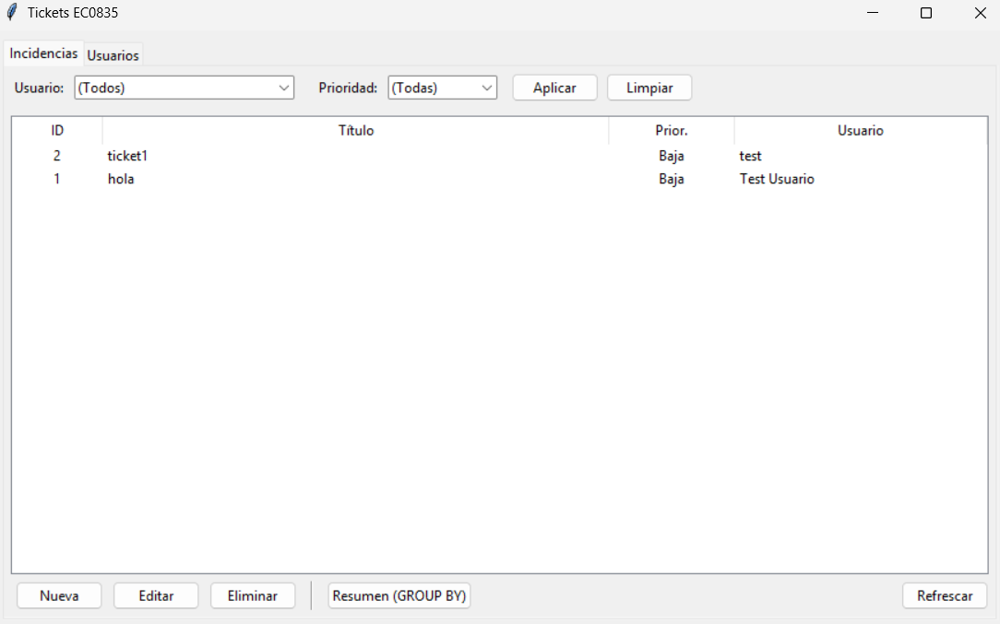

# Manual de Usuario Tickets - EC0835

# Manual de Usuario — Sistema de Tickets (EC0835)

---

# Página de portada

**Sistema:** Tickets (Usuarios e Incidencias)

**Documento:** Manual de Usuario

**Versión:** 1.0

**Fecha:** 14 de agosto de 2025

**Autor:** Cristopher Arael García Torres

**Contacto:** crisarael@gmail.com

> Este documento describe el uso básico del sistema de Tickets.
> 

---

# Página de título

**Título:** Manual de Usuario — Sistema de Tickets (EC0835)

**Producto:** Aplicación de escritorio en Python (Tkinter + SQLite)

**Alcance:** Operación funcional

**Público objetivo:** Usuarios finales que operarán la app

**Historial de cambios**

- v1.0 — 14/08/2025 — Primera edición

---

## 1. Introducción

El sistema de **Tickets** permite registrar y gestionar **incidencias** asignándolas a **usuarios**. La interfaz es de escritorio (Tkinter), el almacenamiento es local mediante **SQLite**, y el sistema presenta funciones de **alta, consulta, edición y eliminación** (CRUD).

Además, ofrece filtros por usuario y prioridad, un listado combinado (JOIN) que muestra la incidencia con el nombre del usuario, y un **resumen** (GROUP BY) con el conteo de incidencias por usuario.

**Qué puedes hacer con este sistema:**
- Crear, editar y eliminar **Usuarios** (con email único).
- Crear, editar y eliminar **Incidencias** (título, descripción, prioridad y usuario asignado).
- Filtrar incidencias por **Usuario** y **Prioridad**.
- Obtener **resumen** de incidencias por usuario.

---

## 2. Requisitos de instalación

### 2.1 Usar ejecutable (.exe) *(recomendada para usuario final)*

- **Sistema Operativo:** Windows 10/11.
- **Permisos:** Usuario estándar (no requiere administrador).
- **Dependencias:** Ninguna adicional. La base de datos **app.db** se crea automáticamente junto al ejecutable la primera vez que se abre.

### 2.2 Ejecutar desde código fuente (para desarrollo)

- **Windows 10/11** con **Python 3.10+** y **pip**.
- Librerías Python: `sqlalchemy>=2.0`, `alembic>=1.13`
- (Opcional) **Git** si vas a clonar el proyecto.

---

## 3. Instalación y configuración

### 3.1 Instalación desde Ejecutable (.exe)

1. Copia **`main.exe`** (o el ejecutable generado) a una carpeta de tu preferencia.
2. Haz doble clic para abrir la aplicación.
3. Al primer inicio se creará **`app.db`** en la misma carpeta.
4. Crea tu primer **Usuario** (ver sección 4.2).

> Respaldo: para respaldar datos, copia el archivo app.db con la aplicación cerrada.
> 

### 3.2 Configuración  —  desde Código fuente

1. Abre **PowerShell** en la carpeta del proyecto.
2. Crea y activa entorno virtual:
    
    ```powershell
    python -m venv venv
    .env\Scripts\Activate
    ```
    
3. Instala dependencias:
    
    ```powershell
    pip install sqlalchemy alembic
    ```
    
4. Inicializa Alembic y aplica la migración inicial:
    
    ```powershell
    alembic init alembic
    # En alembic.ini: sqlalchemy.url = sqlite:///app.db# En alembic\env.py: 
    importar Base desde models.py y setear target_metadata = Base.metadataalembic revision --autogenerate -m "init"alembic upgrade head
    ```
    
    Si **no** usas Alembic, asegúrate de que el proyecto cree las tablas automáticamente al iniciar (o de ejecutar un script de creación).
    
5. Ejecuta la aplicación:
    
    ```powershell
    python main.py
    ```
    

---

## 4. Guía de uso — funciones básicas

### 4.1 Inicio de la aplicación

- Al abrir la app aparece la ventana principal con dos pestañas: **Incidencias** y **Usuarios**.
- En la parte superior de *Incidencias* verás filtros por **Usuario** y **Prioridad**.



### 4.2 Gestión de Usuarios

1. En la pestaña **Usuarios**, pulsa **Nuevo** para crear un usuario.
    - Completa **Nombre** y **Email** (el email no puede repetirse).
2. Para **Editar**, selecciona un usuario y pulsa **Editar**.
3. Para **Eliminar**, selecciona un usuario y pulsa **Eliminar**.
    - Si el usuario tiene incidencias registradas, el sistema mostrará un mensaje y no permitirá eliminarlo.
4. Pulsa **Refrescar** para actualizar la lista.

### 4.3 Gestión de Incidencias (Tickets)

1. En la pestaña **Incidencias**, pulsa **Nueva** para registrar una incidencia.
    - Completa **Título**, **Descripción**, **Prioridad** (Baja/Media/Alta) y **Usuario** asignado.
2. Para **Editar**, selecciona una incidencia y pulsa **Editar**.
3. Para **Eliminar**, selecciona una incidencia y pulsa **Eliminar** (se solicitará confirmación).
4. Usa los **Filtros** (Usuario / Prioridad) y pulsa **Aplicar** para acotar el listado.
    - Pulsa **Limpiar** para quitar filtros.
5. Pulsa **Refrescar** para recargar datos.
6. **Resumen (GROUP BY):** pulsa el botón **Resumen** para ver el conteo de incidencias por usuario.
    - El listado principal combina datos de incidencia con el **nombre del usuario** (JOIN) cuando no aplicas filtros.

### 4.4 Respaldo y restauración

- **Respaldo:** cierra la aplicación y copia el archivo **`app.db`**.
- **Restauración:** reemplaza el `app.db` por tu copia (con la aplicación cerrada).

---

## 5. Solución de problemas (FAQ)

- **No puedo abrir el ejecutable.**
    
    Descarga y ejecuta desde una carpeta local (no en ubicaciones restringidas). Si Windows SmartScreen bloquea, elige *Más información* → *Ejecutar de todas formas*.
    
- **No puedo eliminar un usuario.**
    
    Verifica que no tenga incidencias registradas. Si existen, elimínalas o reasígnalas primero.
    
- **No veo mis cambios en el listado.**
    
    Pulsa **Refrescar**. Si abriste filtros, verifica que no estén ocultando resultados.
    
- **Error “no such table: usuarios/incidencias”.**
    
    Asegúrate de haber creado/aplicado las **migraciones** (Alembic) o de que las tablas se creen en el primer inicio. Si cambiaste de carpeta, confirma que el `app.db` correcto esté junto al ejecutable/archivos `.py`.
    

---

## 6. Glosario

- **Ticket / Incidencia:** Registro de un problema, solicitud o tarea a realizar.
- **Usuario:** Persona responsable o solicitante; propietario de incidencias.
- **Prioridad:** Nivel de urgencia de la incidencia (Baja/Media/Alta).
- **CRUD:** Conjunto de operaciones básicas: Crear (Create), Leer (Read), Actualizar (Update) y Eliminar (Delete).
- **SQLite:** Motor de base de datos embebido que almacena en un solo archivo (`app.db`).
- **ORM (SQLAlchemy):** Capa que mapea clases de Python a tablas SQL y simplifica consultas.
- **JOIN (Combinación):** Consulta que une datos de tablas relacionadas (Incidencia ↔︎ Usuario).
- **GROUP BY (Agrupación):** Consulta que agrupa filas para obtener conteos o métricas.
- **Migración (Alembic):** Archivo/versionado de cambios en el esquema de la base de datos.
- **Entorno virtual (venv):** Carpeta que aísla dependencias de Python para un proyecto.

---

## 7. Contacto y soporte

Para soporte, documenta: pasos realizados, mensajes de error y captura de pantalla. Proporciona el archivo `app.db` solo si se solicita y sin datos sensibles.