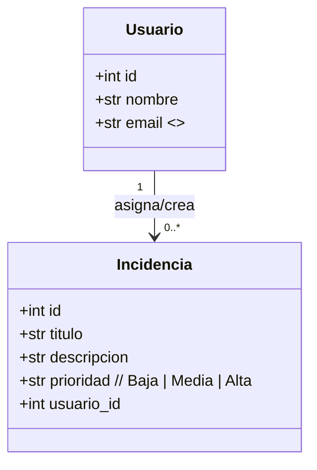
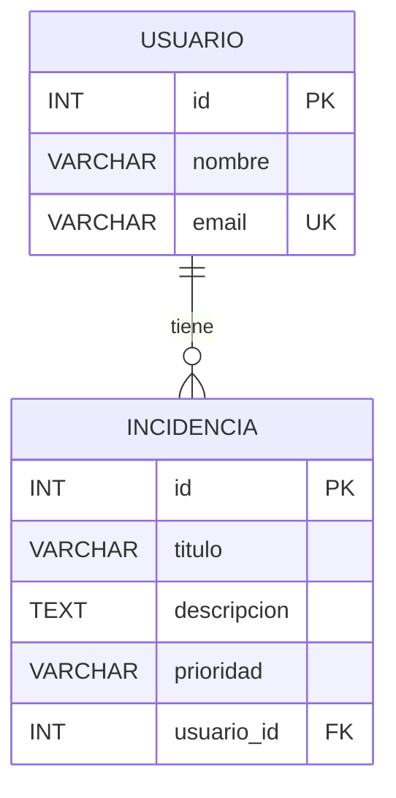

# Manual Técnico Tickets - EC0835

# Manual Técnico — Sistema de Tickets (EC0835)

## Índice

1. Introducción
2. Objetivo general del sistema
3. Objetivos específicos
4. Requerimientos de instalación
5. Diagrama de clases (UML)
6. Diagrama Entidad–Relación (ER)
7. Desarrollo y código de la aplicación

---

## 1. Introducción

El sistema de **Tickets** es una aplicación de escritorio desarrollada en **Python 3.10+** con **Tkinter** (GUI) y **SQLite** como motor de base de datos local. La persistencia y consultas se implementan con **SQLAlchemy** (ORM) y las **migraciones** con **Alembic**.

El propósito es gestionar incidencias (tickets) asociadas a usuarios, demostrando para el EC0835: **inserción, selección, actualización, eliminación, combinación (JOIN) y agrupación (GROUP BY)**.

---

## 2. Objetivo general del sistema

Desarrollar y desplegar un sistema sencillo de **gestión de incidencias** que permita administrar **Usuarios** e **Incidencias**, cumpliendo con el CRUD completo y las consultas solicitadas por el usuario.

---

## 3. Objetivos específicos

- Registrar, editar y eliminar **Usuarios** con restricción de **email único**.
- Registrar, editar, eliminar y consultar **Incidencias** con campos: *título, descripción, prioridad, usuario asignado*.
- Implementar consultas:
    - **SELECT** con filtros por usuario/prioridad.
    - **JOIN** para listar incidencias junto con el **nombre del usuario**.
    - **GROUP BY** para obtener métricas (p. ej., incidencias por usuario / por prioridad).
- Mantener el esquema de base de datos mediante **migraciones Alembic**.
- Empaquetar la app a `.exe` para su distribución en Windows.

---

## 4. Requerimientos de instalación

### 4.1. Software

- **Sistema operativo**: Windows 10/11 (probado).
- **Python**: 3.10 o superior (incluye Tkinter).
- **Pip**: incluido con Python.
- **Librerías**:
    - `sqlalchemy>=2.0`
    - `alembic>=1.13`
    - `pyinstaller` para generar `.exe`.

**Archivo `requirements.txt` recomendado:**

```
sqlalchemy>=2.0
alembic>=1.13
```

### 4.2. Estructura de proyecto

```
tickets_app/
│  main.py
│  models.py
│  db.py
│  crud.py
│  requirements.txt
│  alembic.ini           (lo crea Alembic)
└─ alembic/              (lo crea Alembic)
   ├─ env.py
   └─ versions/
```

### 4.3. Instalación y puesta en marcha (Windows PowerShell)

```powershell
# 1) Crear y activar 
python -m venv venv
.env\Scripts\Activate
# 2) Instalar dependencias
pip install -r requirementos.txt
# 3) Inicializar Alembic (solo primera vez)
alembic init alembic
# 4) Configurar Alembic
# - En alembic.ini: 
sqlalchemy.url = sqlite:///app.db
# -En alembic\env.py: importar Base desde models.py y setear target_metadata = Base.metadata
 # 5) Crear migración inicial y aplicarla 
 alembic revision --autogenerate -m "init"  
 alembic upgrade head
# 6) Ejecutar la aplicación
python main.py
```

 **generar .exe**

```powershell
pip install pyinstaller
pyinstaller --onefile --noconsole main.py# Ejecutable en dist/main.exe
```

---

## 5. Diagrama de clases (UML)

> Puedes pegar este bloque en Notion como bloque de código con el lenguaje Mermaid (Notion lo renderiza).
> 



---

## 6. Diagrama Entidad–Relación (ER)



**Notas del modelo**
- `USUARIO.email` es **único**.

- `INCIDENCIA.usuario_id` es **FK** a `USUARIO.id`.

- Cardinalidad: **1 a N** (un usuario puede tener muchas incidencias).

---

## 7. Desarrollo y código de la aplicación

**Arquitectura y estructura**

- **UI (Tkinter)** → ventanas, formularios y tablas.
- **Capa de servicios (CRUD)** → funciones de negocio y validaciones.
- **ORM (SQLAlchemy)** → modelos y consultas.
- **BD (SQLite)** → archivo `app.db`.
- **Migraciones (Alembic)** → versionado del esquema.

tickets_app/
├─ [main.py](http://main.py/)        # UI: pestañas Usuarios/Incidencias, filtros y diálogos
├─ [crud.py](http://crud.py/)        # Lógica CRUD + validaciones + consultas especiales
├─ [models.py](http://models.py/)      # Modelos SQLAlchemy (Usuario, Incidencia)
├─ [db.py](http://db.py/)          # Engine/Session y PRAGMA foreign_keys=ON
└─ alembic/       # [env.py](http://env.py/) + versions/ (scripts de migración)

- **`db.py`**: configuración del `engine`, `SessionLocal` y `PRAGMA foreign_keys=ON`.

```python
from sqlalchemy import create_engine, event
from sqlalchemy.engine import Engine
from sqlalchemy.orm import sessionmaker
from pathlib import Path

BASE_DIR = Path(__file__).resolve().parent
DB_PATH = BASE_DIR / "app.db"
DATABASE_URL = f"sqlite:///{DB_PATH.as_posix()}"

engine = create_engine(DATABASE_URL, future=True, echo=False)

@event.listens_for(Engine, "connect")
def _fk_on(conn, _):
    cur = conn.cursor()
    cur.execute("PRAGMA foreign_keys=ON")
    cur.close()

SessionLocal = sessionmaker(bind=engine, future=True, autoflush=False, expire_on_commit=False)

```

- **`models.py`**: `Base = declarative_base()`, clases `Usuario` e `Incidencia`.

```
from sqlalchemy.orm import declarative_base, relationship
from sqlalchemy import Column, Integer, String, ForeignKey, Text

Base = declarative_base()

class Usuario(Base):
    __tablename__ = "usuarios"
    id = Column(Integer, primary_key=True)
    nombre = Column(String(120), nullable=False)
    email  = Column(String(180), unique=True, nullable=False)
    incidencias = relationship("Incidencia", back_populates="usuario")

class Incidencia(Base):
    __tablename__ = "incidencias"
    id = Column(Integer, primary_key=True)
    titulo = Column(String(150), nullable=False)
    descripcion = Column(Text, nullable=False)
    prioridad = Column(String(20), nullable=False)   # Baja/Media/Alta
    usuario_id = Column(Integer, ForeignKey("usuarios.id"), nullable=False)
    usuario = relationship("Usuario", back_populates="incidencias")

```

- **`crud.py`**: funciones CRUD + consultas `JOIN` y `GROUP BY`.

```python
from sqlalchemy import select, func
from sqlalchemy.exc import IntegrityError
from sqlalchemy.orm import joinedload
from db import SessionLocal
from models import Usuario, Incidencia

# ---------- USUARIOS (CRUD) ----------
def crear_usuario(nombre: str, email: str):
    with SessionLocal() as s:
        u = Usuario(nombre=nombre.strip(), email=email.strip().lower())
        s.add(u)
        try:
            s.commit()
        except IntegrityError:
            s.rollback()
            raise ValueError("El email ya existe.")
        s.refresh(u)
        return u

def listar_usuarios():
    with SessionLocal() as s:
        return list(s.scalars(select(Usuario).order_by(Usuario.nombre)))

def obtener_usuario(usuario_id: int):
    with SessionLocal() as s:
        return s.get(Usuario, usuario_id)

def editar_usuario(usuario_id: int, nombre: str, email: str):
    with SessionLocal() as s:
        u = s.get(Usuario, usuario_id)
        if not u:
            return None
        u.nombre = nombre.strip()
        u.email  = email.strip().lower()
        try:
            s.commit()
        except IntegrityError:
            s.rollback()
            raise ValueError("El email ya existe.")
        s.refresh(u)
        return u

def eliminar_usuario(usuario_id: int):
    with SessionLocal() as s:
        u = s.get(Usuario, usuario_id)
        if not u:
            return False
        # Bloquea si tiene incidencias asociadas (opcional)
        cnt = s.scalar(select(func.count(Incidencia.id)).where(Incidencia.usuario_id == usuario_id))
        if cnt and cnt > 0:
            raise ValueError("No se puede eliminar: tiene incidencias asociadas.")
        s.delete(u); s.commit()
        return True

# ---------- INCIDENCIAS (CRUD) ----------
def crear_incidencia(titulo: str, descripcion: str, prioridad: str, usuario_id: int):
    with SessionLocal() as s:
        if not s.get(Usuario, usuario_id):
            raise ValueError("Usuario no existe.")
        inc = Incidencia(
            titulo=titulo.strip(),
            descripcion=descripcion.strip(),
            prioridad=prioridad.strip(),
            usuario_id=usuario_id
        )
        s.add(inc); s.commit(); s.refresh(inc)
        return inc

def listar_incidencias(usuario_id: int | None = None, prioridad: str | None = None):
    # SELECT (búsqueda normal)
    with SessionLocal() as s:
        stmt = select(Incidencia).options(joinedload(Incidencia.usuario)).order_by(Incidencia.id.desc())
        if usuario_id:
            stmt = stmt.where(Incidencia.usuario_id == usuario_id)
        if prioridad:
            stmt = stmt.where(Incidencia.prioridad == prioridad)
        return list(s.scalars(stmt))

def obtener_incidencia(inc_id: int):
    with SessionLocal() as s:
        return s.get(Incidencia, inc_id)

def editar_incidencia(inc_id: int, **campos):
    # UPDATE
    with SessionLocal() as s:
        inc = s.get(Incidencia, inc_id)
        if not inc:
            return None
        if "usuario_id" in campos and not s.get(Usuario, campos["usuario_id"]):
            raise ValueError("Usuario destino no existe.")
        for k, v in campos.items():
            setattr(inc, k, v)
        s.commit(); s.refresh(inc)
        return inc

def eliminar_incidencia(inc_id: int):
    # DELETE
    with SessionLocal() as s:
        inc = s.get(Incidencia, inc_id)
        if not inc:
            return False
        s.delete(inc); s.commit()
        return True

# ---------- CONSULTAS ESPECIALES ----------
def incidencias_join_con_usuario():
    # JOIN: Incidencia + Usuario.nombre
    with SessionLocal() as s:
        stmt = (
            select(Incidencia.id, Incidencia.titulo, Incidencia.prioridad, Usuario.nombre)
            .join(Usuario, Usuario.id == Incidencia.usuario_id)
            .order_by(Incidencia.id.desc())
        )
        return s.execute(stmt).all()

def conteo_incidencias_por_usuario():
    # GROUP BY: cuántas incidencias por usuario
    with SessionLocal() as s:
        stmt = (
            select(Usuario.nombre, func.count(Incidencia.id))
            .join(Incidencia, Incidencia.usuario_id == Usuario.id, isouter=True)
            .group_by(Usuario.nombre)
            .order_by(Usuario.nombre)
        )
        return s.execute(stmt).all()

```

- **`main.py`**: interfaz **Tkinter** (pestañas Usuarios/Incidencias, filtros, diálogos)
```

```python
import tkinter as tk
from tkinter import ttk, messagebox
from crud import (
    listar_usuarios, crear_usuario, editar_usuario, eliminar_usuario, obtener_usuario,
    listar_incidencias, crear_incidencia, editar_incidencia, eliminar_incidencia,
    obtener_incidencia, conteo_incidencias_por_usuario, incidencias_join_con_usuario
)

PRIORIDADES = ["Baja", "Media", "Alta"]

# ---- Diálogos simples ----
class UsuarioDialog(tk.Toplevel):
    def __init__(self, master, usuario=None):
        super().__init__(master)
        self.title("Usuario")
        self.resizable(False, False)
        self.result = None
        self.transient(master)  # Hacer el diálogo dependiente de la ventana principal
        
        # Crear la interfaz
        tk.Label(self, text="Nombre:").grid(row=0, column=0, sticky="e", padx=6, pady=6)
        tk.Label(self, text="Email:").grid(row=1, column=0, sticky="e", padx=6, pady=6)
        
        self.var_nombre = tk.StringVar(value=getattr(usuario, "nombre", ""))
        self.var_email  = tk.StringVar(value=getattr(usuario, "email", ""))
        
        self.entry_nombre = tk.Entry(self, textvariable=self.var_nombre, width=30)
        self.entry_email = tk.Entry(self, textvariable=self.var_email, width=30)
        
        self.entry_nombre.grid(row=0, column=1, padx=6, pady=6)
        self.entry_email.grid(row=1, column=1, padx=6, pady=6)
        
        # Botones
        frm = tk.Frame(self)
        frm.grid(row=2, column=0, columnspan=2, pady=6)
        
        ttk.Button(frm, text="Guardar", command=self._ok).pack(side="left", padx=6)
        ttk.Button(frm, text="Cancelar", command=self._cancel).pack(side="left")
        
        # Configurar el diálogo modal
        self.grab_set()
        self.protocol("WM_DELETE_WINDOW", self._cancel)
        
        # Centrar el diálogo
        self.geometry("350x120")
        self.update_idletasks()
        x = (self.winfo_screenwidth() // 2) - (self.winfo_width() // 2)
        y = (self.winfo_screenheight() // 2) - (self.winfo_height() // 2)
        self.geometry(f"+{x}+{y}")
        
        # Foco en el primer campo
        self.entry_nombre.focus_set()

    def _ok(self):
        n = self.var_nombre.get().strip()
        e = self.var_email.get().strip()
        
        print(f"DEBUG: UsuarioDialog._ok() - Nombre: '{n}', Email: '{e}'")  # DEBUG
        
        if not n or not e:
            messagebox.showwarning("Validación", "Nombre y email son obligatorios.", parent=self)
            return
            
        self.result = (n, e)
        print(f"DEBUG: UsuarioDialog._ok() - Resultado establecido: {self.result}")  # DEBUG
        self.destroy()

    def _cancel(self):
        print("DEBUG: UsuarioDialog._cancel() - Diálogo cancelado")  # DEBUG
        self.result = None
        self.destroy()

class IncidenciaDialog(tk.Toplevel):
    def __init__(self, master, usuarios, incidencia=None):
        super().__init__(master); self.title("Incidencia"); self.resizable(False, False)
        self.result = None; self.usuarios = usuarios
        tk.Label(self, text="Título:").grid(row=0, column=0, sticky="e", padx=6, pady=6)
        tk.Label(self, text="Descripción:").grid(row=1, column=0, sticky="ne", padx=6, pady=6)
        tk.Label(self, text="Prioridad:").grid(row=2, column=0, sticky="e", padx=6, pady=6)
        tk.Label(self, text="Usuario:").grid(row=3, column=0, sticky="e", padx=6, pady=6)

        self.var_titulo = tk.StringVar(value=getattr(incidencia, "titulo", ""))
        self.txt_desc   = tk.Text(self, width=40, height=5)
        if incidencia: self.txt_desc.insert("1.0", incidencia.descripcion)

        self.cmb_pri = ttk.Combobox(self, values=PRIORIDADES, state="readonly", width=14)
        self.cmb_pri.set(getattr(incidencia, "prioridad", PRIORIDADES[0]))

        nombres = [u.nombre for u in usuarios]
        self.cmb_usr = ttk.Combobox(self, values=nombres, state="readonly", width=25)
        if incidencia:
            # seleccionar usuario actual
            for idx, u in enumerate(usuarios):
                if u.id == incidencia.usuario_id: self.cmb_usr.current(idx); break
        elif usuarios:
            self.cmb_usr.current(0)

        tk.Entry(self, textvariable=self.var_titulo, width=45).grid(row=0, column=1, padx=6, pady=6)
        self.txt_desc.grid(row=1, column=1, padx=6, pady=6)
        self.cmb_pri.grid(row=2, column=1, padx=6, pady=6)
        self.cmb_usr.grid(row=3, column=1, padx=6, pady=6)

        frm = tk.Frame(self); frm.grid(row=4, column=0, columnspan=2, pady=6)
        ttk.Button(frm, text="Guardar", command=self._ok).pack(side="left", padx=6)
        ttk.Button(frm, text="Cancelar", command=self.destroy).pack(side="left")
        self.grab_set(); self.wait_visibility(); self.focus()

    def _ok(self):
        t = self.var_titulo.get().strip()
        d = self.txt_desc.get("1.0", "end").strip()
        p = self.cmb_pri.get().strip()
        i = self.cmb_usr.current()
        if not t or not d or i < 0:
            messagebox.showwarning("Validación", "Completa los campos requeridos.", parent=self); return
        self.result = (t, d, p, self.usuarios[i].id); self.destroy()

# ---- App principal (2 pestañas) ----
class App(tk.Tk):
    def __init__(self):
        super().__init__(); self.title("Tickets EC0835"); self.geometry("880x520")
        nb = ttk.Notebook(self); nb.pack(fill="both", expand=True, padx=8, pady=8)
        self.tab_inc = tk.Frame(nb); self.tab_usr = tk.Frame(nb)
        nb.add(self.tab_inc, text="Incidencias"); nb.add(self.tab_usr, text="Usuarios")
        self._build_usuarios_tab(); self._build_incidencias_tab(); self._reload_all()

    # ---------- Usuarios ----------
    def _build_usuarios_tab(self):
        cols = ("id", "nombre", "email")
        self.tv_u = ttk.Treeview(self.tab_usr, columns=cols, show="headings", height=16)
        for c, t, w in (("id","ID",60),("nombre","Nombre",220),("email","Email",280)):
            self.tv_u.heading(c, text=t); self.tv_u.column(c, width=w)
        self.tv_u.pack(fill="both", expand=True, padx=6, pady=6)

        frm = tk.Frame(self.tab_usr); frm.pack(fill="x", padx=6, pady=(0,6))
        ttk.Button(frm, text="Nuevo",   command=self._u_new).pack(side="left", padx=4)
        ttk.Button(frm, text="Editar",  command=self._u_edit).pack(side="left", padx=4)
        ttk.Button(frm, text="Eliminar",command=self._u_del).pack(side="left", padx=4)
        ttk.Button(frm, text="Refrescar",command=self._reload_users).pack(side="right")

    def _u_sel(self):
        sel = self.tv_u.selection()
        return int(sel[0]) if sel else None

    def _u_new(self):
        print("DEBUG: Iniciando creación de usuario...")  # DEBUG
        dlg = UsuarioDialog(self)
        
        # Forzar el procesamiento de eventos antes de continuar
        dlg.focus_force()
        self.wait_window(dlg)
        
        print(f"DEBUG: Diálogo cerrado. Resultado: {getattr(dlg, 'result', 'No result')}")  # DEBUG
        
        if hasattr(dlg, 'result') and dlg.result:
            print(f"DEBUG: Datos del formulario: {dlg.result}")  # DEBUG
            try:
                usuario_creado = crear_usuario(*dlg.result)
                print(f"DEBUG: Usuario creado exitosamente: {usuario_creado.id} - {usuario_creado.nombre}")  # DEBUG
                
                # Forzar actualización
                self.update()  # Procesar eventos pendientes
                self._reload_users()
                self._reload_inc_filters()
                
                messagebox.showinfo("Éxito", f"Usuario '{usuario_creado.nombre}' creado exitosamente.")
            except Exception as e:
                print(f"DEBUG: Error al crear usuario: {e}")  # DEBUG
                messagebox.showerror("Error", str(e), parent=self)
        else:
            print("DEBUG: Diálogo cancelado o sin datos")  # DEBUG

    def _u_edit(self):
        uid = self._u_sel()
        if not uid: return messagebox.showwarning("Atención","Selecciona un usuario.",parent=self)
        u = obtener_usuario(uid)
        dlg = UsuarioDialog(self, u)
        self.wait_window(dlg)  # Esperar a que el diálogo se cierre
        
        if dlg.result:
            try:
                editar_usuario(uid, *dlg.result)
                self._reload_users()
                self._reload_inc_filters()
                self._reload_incs()
                messagebox.showinfo("Éxito", "Usuario editado exitosamente.")
            except Exception as e:
                messagebox.showerror("Error", str(e), parent=self)

    def _u_del(self):
        uid = self._u_sel()
        if not uid: return messagebox.showwarning("Atención","Selecciona un usuario.",parent=self)
        if not messagebox.askyesno("Confirmar", f"¿Eliminar usuario {uid}?", parent=self): return
        try:
            eliminar_usuario(uid)
            self._reload_users()
            self._reload_inc_filters()
            self._reload_incs()
            messagebox.showinfo("Éxito", "Usuario eliminado exitosamente.")
        except Exception as e:
            messagebox.showerror("Error", str(e), parent=self)

    def _reload_users(self):
        print("DEBUG: Recargando lista de usuarios...")  # DEBUG
        
        try:
            # Limpiar TreeView
            children = self.tv_u.get_children()
            print(f"DEBUG: Eliminando {len(children)} elementos del TreeView")  # DEBUG
            for i in children:
                self.tv_u.delete(i)
            
            # Obtener usuarios de la base de datos
            usuarios = listar_usuarios()
            print(f"DEBUG: Usuarios obtenidos de la BD: {len(usuarios)}")  # DEBUG
            
            # Agregar usuarios al TreeView
            for u in usuarios:
                print(f"DEBUG: Insertando usuario: {u.id} - {u.nombre} - {u.email}")  # DEBUG
                self.tv_u.insert("", "end", iid=str(u.id), values=(u.id, u.nombre, u.email))
            
            # Forzar actualización visual
            self.tv_u.update_idletasks()
            
            final_count = len(self.tv_u.get_children())
            print(f"DEBUG: TreeView ahora tiene {final_count} elementos")  # DEBUG
            
            if final_count != len(usuarios):
                print(f"DEBUG: ¡ADVERTENCIA! Discrepancia: BD={len(usuarios)}, TreeView={final_count}")
                
        except Exception as e:
            print(f"DEBUG: Error en _reload_users: {e}")  # DEBUG
            import traceback
            traceback.print_exc()

    # ---------- Incidencias ----------
    def _build_incidencias_tab(self):
        # filtros
        top = tk.Frame(self.tab_inc); top.pack(fill="x", padx=6, pady=6)
        tk.Label(top, text="Usuario:").pack(side="left"); 
        self.cmb_u = ttk.Combobox(top, state="readonly", width=28); self.cmb_u.pack(side="left", padx=6)
        tk.Label(top, text="Prioridad:").pack(side="left", padx=(12,0))
        self.cmb_p = ttk.Combobox(top, values=["(Todas)","Baja","Media","Alta"], state="readonly", width=12); 
        self.cmb_p.set("(Todas)"); self.cmb_p.pack(side="left", padx=6)
        ttk.Button(top, text="Aplicar", command=self._reload_incs).pack(side="left", padx=6)
        ttk.Button(top, text="Limpiar", command=self._clear_filters).pack(side="left")

        cols = ("id","titulo","prioridad","usuario")
        self.tv_i = ttk.Treeview(self.tab_inc, columns=cols, show="headings", height=16)
        self.tv_i.heading("id", text="ID");            self.tv_i.column("id", width=60, anchor="center")
        self.tv_i.heading("titulo", text="Título");    self.tv_i.column("titulo", width=420)
        self.tv_i.heading("prioridad", text="Prior."); self.tv_i.column("prioridad", width=90, anchor="center")
        self.tv_i.heading("usuario", text="Usuario");  self.tv_i.column("usuario", width=200)
        self.tv_i.pack(fill="both", expand=True, padx=6, pady=6)

        bottom = tk.Frame(self.tab_inc); bottom.pack(fill="x", padx=6, pady=(0,6))
        ttk.Button(bottom, text="Nueva",   command=self._i_new).pack(side="left", padx=4)
        ttk.Button(bottom, text="Editar",  command=self._i_edit).pack(side="left", padx=4)
        ttk.Button(bottom, text="Eliminar",command=self._i_del).pack(side="left", padx=4)
        ttk.Separator(bottom, orient="vertical").pack(side="left", fill="y", padx=8)
        ttk.Button(bottom, text="Resumen (GROUP BY)", command=self._i_summary).pack(side="left", padx=4)
        ttk.Button(bottom, text="Refrescar", command=self._reload_incs).pack(side="right")

    def _i_sel(self):
        sel = self.tv_i.selection()
        return int(sel[0]) if sel else None

    def _i_new(self):
        if not self._u_cache:
            return messagebox.showinfo("Info","Primero crea un usuario.", parent=self)
        dlg = IncidenciaDialog(self, self._u_cache)
        self.wait_window(dlg)  # Esperar a que el diálogo se cierre
        
        if dlg.result:
            t, d, p, uid = dlg.result
            try:
                incidencia_creada = crear_incidencia(t, d, p, uid)
                self._reload_incs()
                messagebox.showinfo("Éxito", f"Incidencia '{incidencia_creada.titulo}' creada exitosamente.")
            except Exception as e:
                messagebox.showerror("Error", str(e), parent=self)

    def _i_edit(self):
        iid = self._i_sel()
        if not iid: return messagebox.showwarning("Atención","Selecciona una incidencia.", parent=self)
        inc = obtener_incidencia(iid)
        dlg = IncidenciaDialog(self, self._u_cache, incidencia=inc)
        self.wait_window(dlg)  # Esperar a que el diálogo se cierre
        
        if dlg.result:
            t, d, p, uid = dlg.result
            try:
                editar_incidencia(iid, titulo=t, descripcion=d, prioridad=p, usuario_id=uid)
                self._reload_incs()
                messagebox.showinfo("Éxito", "Incidencia editada exitosamente.")
            except Exception as e:
                messagebox.showerror("Error", str(e), parent=self)

    def _i_del(self):
        iid = self._i_sel()
        if not iid: return messagebox.showwarning("Atención","Selecciona una incidencia.", parent=self)
        if not messagebox.askyesno("Confirmar", f"¿Eliminar incidencia {iid}?", parent=self): return
        if eliminar_incidencia(iid):
            self._reload_incs()
            messagebox.showinfo("Éxito", "Incidencia eliminada exitosamente.")

    def _i_summary(self):
        # GROUP BY
        datos = conteo_incidencias_por_usuario()
        if not datos: return messagebox.showinfo("Resumen", "Sin datos.")
        txt = "\n".join(f"{n}: {c}" for n, c in datos)
        messagebox.showinfo("Incidencias por usuario", txt)

    def _reload_inc_filters(self):
        self._u_cache = listar_usuarios()
        self.cmb_u["values"] = ["(Todos)"] + [u.nombre for u in self._u_cache]
        self.cmb_u.set("(Todos)")

    def _clear_filters(self):
        self.cmb_u.set("(Todos)"); self.cmb_p.set("(Todas)"); self._reload_incs()

    def _get_user_filter(self):
        sel = self.cmb_u.get()
        if sel == "(Todos)" or not sel: return None
        for u in self._u_cache:
            if u.nombre == sel: return u.id
        return None

    def _get_prio_filter(self):
        sel = self.cmb_p.get()
        return None if sel in ("", "(Todas)") else sel

    def _reload_incs(self):
        # JOIN para mostrar el nombre del usuario
        uid = self._get_user_filter(); prio = self._get_prio_filter()
        for i in self.tv_i.get_children(): self.tv_i.delete(i)
        if uid or prio:
            # si hay filtro, usamos consulta normal (select) y leemos la relación
            for inc in listar_incidencias(uid, prio):
                self.tv_i.insert("", "end", iid=str(inc.id),
                                 values=(inc.id, inc.titulo, inc.prioridad, inc.usuario.nombre if inc.usuario else ""))
        else:
            # sin filtros, demostraremos JOIN explícito
            for inc_id, titulo, pri, nombre in incidencias_join_con_usuario():
                self.tv_i.insert("", "end", iid=str(inc_id), values=(inc_id, titulo, pri, nombre or ""))

    def _reload_all(self):
        self._reload_inc_filters(); self._reload_users(); self._reload_incs()

if __name__ == "__main__":
    App().mainloop()

```

- **`env.py`**: Alembic lo carga **cada vez** que ejecutas un comando (`alembic upgrade`, `downgrade`, `revision`, etc.) y ahí decide **cómo** correr las migraciones.

```
from logging.config import fileConfig
from sqlalchemy import engine_from_config, pool
from alembic import context
import os, sys

# añade el path del proyecto para importar models.py
BASE_DIR = os.path.dirname(os.path.dirname(os.path.abspath(__file__)))
if BASE_DIR not in sys.path:
    sys.path.insert(0, BASE_DIR)

from models import Base  # <-- tu metadata

config = context.config
if config.config_file_name is not None:
    fileConfig(config.config_file_name)

target_metadata = Base.metadata

def run_migrations_offline():
    url = config.get_main_option("sqlalchemy.url")
    context.configure(url=url, target_metadata=target_metadata, literal_binds=True, compare_type=True)
    with context.begin_transaction():
        context.run_migrations()

def run_migrations_online():
    connectable = engine_from_config(config.get_section(config.config_ini_section), prefix="sqlalchemy.", poolclass=pool.NullPool)
    with connectable.connect() as connection:
        context.configure(connection=connection, target_metadata=target_metadata, compare_type=True)
        with context.begin_transaction():
            context.run_migrations()

if context.is_offline_mode():
    run_migrations_offline()
else:
    run_migrations_online()

```